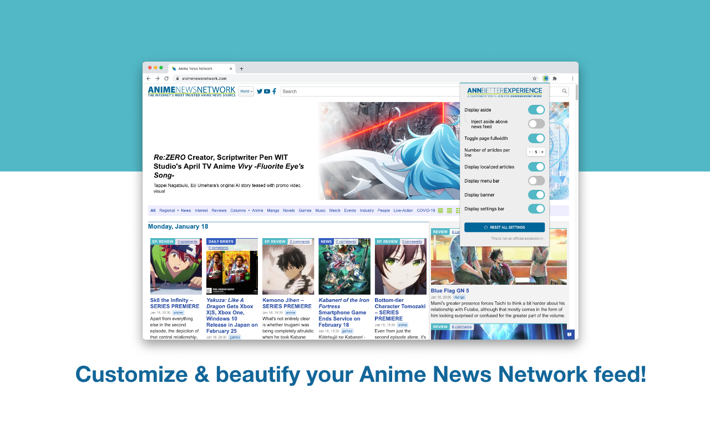
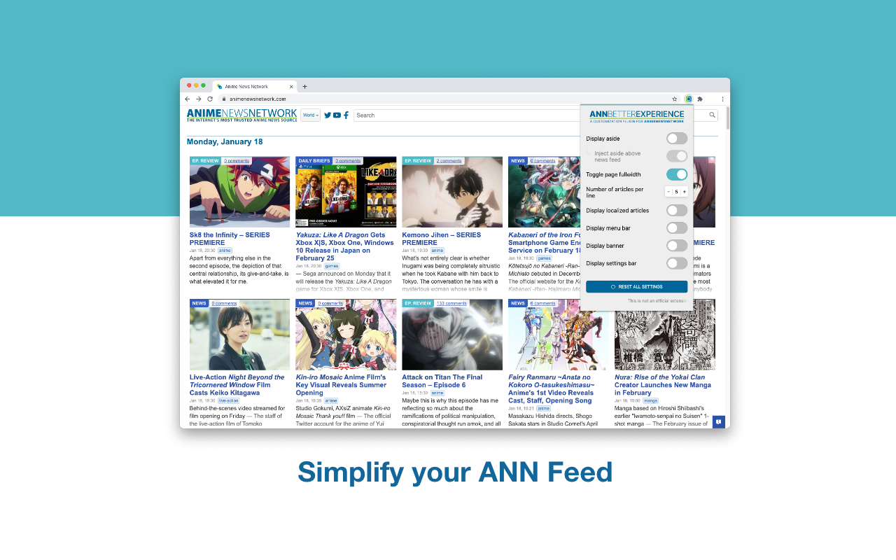

# ANN Better Experience

## Why
Anime News Network in its basic state is certainly not the most best looking website and is also to be fair,
quite outdated with its current design. This extension will help you to customize and beautify
ANN depending on your preferences.

## Get it
ANN BE is available for chromium based browsers such as Chrome, Brave, Edge...

It's available on the Chrome Web Store:

## How to use
Once the extension is installed, you can access to settings by click on the extension icon to have access
to a large range of setting to make the most of your user experience.

## Features
Anime Better Experience also improves some pages and adds useful features:

### Show the aside section
This setting is quite self-explanatory

### Inject the aside above the news feed
Only available if you choose to show the aside section, this will allow you to have access to the aside feed just above the news feed of ANN.

### Toggle page fullwidth
In its basic state, ANN layout is mostly center to the left and leaves a whole lot of space on the right side of the screen. This will allow you to make most
of the space and thus, the news feed will take the full width.

### Customize the number of articles per line
This will allow you to customize the number of articles per line with 2 inputs buttons.

### Display localized articles
This feature will allow you to display or remove the news that are localised (those with a flag next to tags)

### Display the menu bar
Also self-explanatory, this will allow you to display or remove the menu bar.

### Display the banner
Also self-explanatory, this will allow you to display or remove the main banner of ANN.

### Display the settings bar
Also self-explanatory, this will allow you to display or remove the settings bar.

Feel free to [open a issue](https://github.com/myorave/ann-better-experience/issues/new)!
